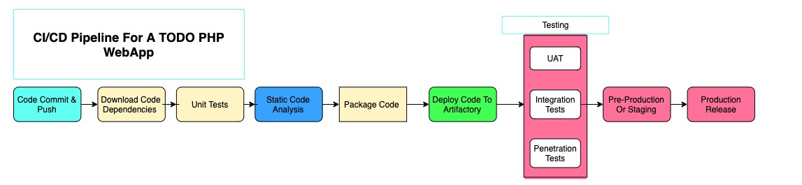
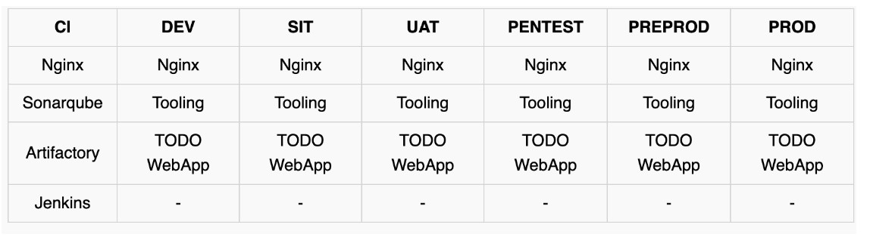
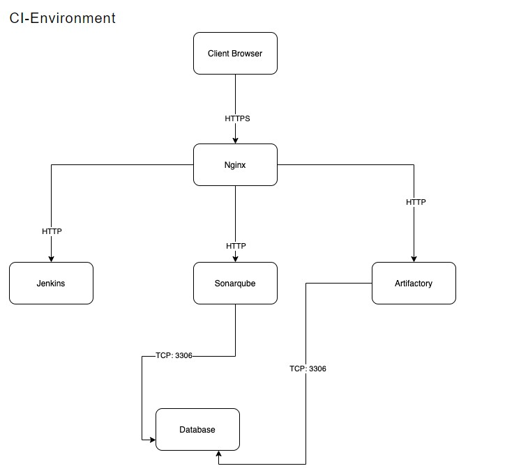
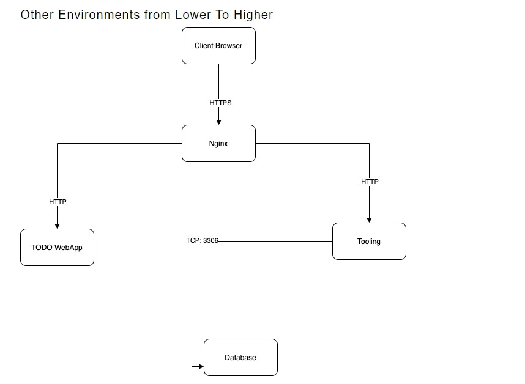
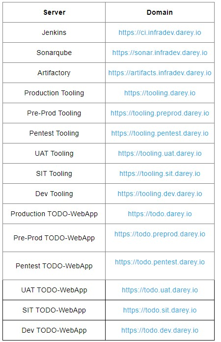

# EXPERIENCE CONTINUOUS INTEGRATION WITH JENKINS | ANSIBLE | ARTIFACTORY | SONARQUBE | PHP

**OBJECTIVE OF THIS PROJECT**

The objectives of this project include:

**Understanding the entire concept of CI/CD:** The project aims to provide a comprehensive understanding of Continuous Integration and Continuous Delivery (CI/CD) from an application perspective. It emphasizes the importance of grasping the entire CI/CD process, the roles of different tools involved, and the success metrics associated with it.

**Exploring different programming languages and platforms:** The project encourages gaining hands-on experience with CI/CD across various programming languages and platforms. While the focus is on PHP in this specific project, future projects will cover Java, Node.js, .Net, Python, as well as Terraform, Docker, and Kubernetes, providing a broader perspective of CI/CD from different application and platform viewpoints.

**Emphasizing the importance of Continuous Integration:** The project highlights the significance of Continuous Integration (CI) in software engineering. It explains the practice of merging developers' working copies to a shared mainline (e.g., a Git repository) multiple times per day. The objective is to reduce conflicts, run tests frequently, and avoid integration issues that can arise when multiple developers work on the same project.

**Encouraging test-driven development:** The project promotes the adoption of Test-Driven Development (TDD) alongside CI. Developers are encouraged to write unit tests for their code and run these tests locally before committing their work. This approach helps prevent one developer's code from breaking others' copies of the codebase.

**Leveraging a dedicated CI server:** The project introduces Jenkins as the chosen CI server. Instead of building the code into an executable locally, developers commit and push their work to a central repository, and the CI server takes over the build process. This setup allows for periodic builds or builds triggered after each commit, enabling visibility into each commit and its corresponding builds for the entire team.

**Running comprehensive tests in the CI environment:** While developers run tests locally, the project emphasizes the importance of running unit tests and other types of tests and code analysis on the CI server. These tests include Static Code Analysis, Code Coverage Analysis, Code Smells Analysis, Compliance Analysis, as well as Integration and Penetration tests. The CI server ensures the overall quality of the code, its compatibility with other developers' work, and its vulnerability to attacks.

**Deploying artifacts from the CI environment:** The project clarifies the difference between Continuous Integration (CI) and Continuous Delivery (CD). While CI focuses on the build and testing stages, CD ensures that the software checked into the mainline is always ready for deployment to users. The project introduces manual deployment triggered after successful QA tasks, and mentions Continuous Deployment as a further step, where the entire deployment process becomes fully automated.

# Architecture of the solution


# SIMULATING A TYPICAL CI/CD PIPELINE FOR A PHP BASED APPLICATION

As part of the ongoing infrastructure development with Ansible started from [workplace-11](https://github.com/olaniyi2oguns/Workplace-11.git), you will be tasked to create a pipeline that simulates continuous integration and delivery. Target end to end CI/CD pipeline is represented by the diagram below. It is important to know that both **Tooling** and **TODO** Web Applications are based on an interpreted ([scripting](https://en.wikipedia.org/wiki/Scripting_language)) language (PHP). It means, it can be deployed directly onto a server and will work without compiling the code to a machine language.

The problem with that approach is, it would be difficult to package and version the software for different releases. And so, in this project, we will be using a different approach for releases, rather than downloading directly from git, we will be using Ansible [uri module](https://docs.ansible.com/ansible/latest/collections/ansible/builtin/uri_module.html).

Find below the pipeline for PHP ToDo WebApp



The tools invole in the set up above are:


# *Set Up*

This project is partly a continuation of your Ansible work, so simply add and subtract based on the new setup in this project. It will require a lot of servers to simulate all the different environments from `dev/ci` all the way to `production`. This will be quite a lot of servers altogether (But you don’t have to create them all at once. Only create servers required for an environment you are working with at the moment. For example, when doing deployments for development, do not create servers for integration, pentest, or production yet).

Try to utilize your AWS free tier as much as you can, you can also register a new account if you have exhausted the current one. Alternatively, you can use [Google Cloud (GCP)](https://cloud.google.com/) to rent virtual machines from this cloud service provider.

To minimize the cost of cloud servers, you don not have to create all the servers at once, simply spin up a minimal server set up as you progress through the project implementation and have reached a need for more.

To get started, we will focus on these environments initially.

    - Ci
    - Dev
    - Pentest
Both SIT – For System Integration Testing and `UAT` – User Acceptance Testing do not require a lot of extra installation or configuration. They are basically the webservers holding our applications. But `Pentest` – For Penetration testing is where we will conduct security related tests, so some other tools and specific configurations will be needed. In some cases, it will also be used for `Performance and Load` testing. Otherwise, that can also be a separate environment on its own. It all depends on decisions made by the company and the team running the show.

What we want to achieve, is having Nginx to serve as a [reverse proxy](https://en.wikipedia.org/wiki/Reverse_proxy) for our sites and tools. Each environment setup is represented in the below table and diagrams.







**DNS requirements**

Make DNS entries to create a subdomain for each environment. Assuming your main domain is darey.io

You should have a subdomains list like this:



Ansible  Inventory should look like this

```
├── ci
├── dev
├── pentest
├── pre-prod
├── prod
├── sit
└── uat
```
CI inventory file

```
[jenkins]
<Jenkins-Private-IP-Address>

[nginx]
<Nginx-Private-IP-Address>

[sonarqube]
<SonarQube-Private-IP-Address>

[artifact_repository]
<Artifact_repository-Private-IP-Address>
```
dev Inventory file
```
[tooling]
<Tooling-Web-Server-Private-IP-Address>

[todo]
<Todo-Web-Server-Private-IP-Address>

[nginx]
<Nginx-Private-IP-Address>

[db:vars]
ansible_user=ec2-user
ansible_python_interpreter=/usr/bin/python

[db]
<DB-Server-Private-IP-Address>
```

pentest inventory file

```
[pentest:children]
pentest-todo
pentest-tooling

[pentest-todo]
<Pentest-for-Todo-Private-IP-Address>

[pentest-tooling]
<Pentest-for-Tooling-Private-IP-Address>
```
**Observations:**

You will notice that in the pentest inventory file, we have introduced a new concept `pentest:children` This is because, we want to have a group called pentest which covers Ansible execution against both `pentest-todo` and `pentest-tooling` simultaneously. But at the same time, we want the flexibility to run specific Ansible tasks against an individual group.
The `db` group has a slightly different configuration. It uses a RedHat/Centos Linux distro. Others are based on Ubuntu (in this case user is `ubuntu`). Therefore, the user required for connectivity and path to python interpreter are different. If all your environment is based on Ubuntu, you may not need this kind of set up. Totally up to you how you want to do this. Whatever works for you is absolutely fine in this scenario.
This makes us to introduce another Ansible concept called `group_vars`. With group vars, we can declare and set variables for each group of servers created in the inventory file.

For example, If there are variables we need to be common between both `pentest-todo` and `pentest-tooling`, rather than setting these variables in many places, we can simply use the `group_vars` for `pentest`. Since in the inventory file it has been created as `pentest:children` Ansible recognizes this and simply applies that variable to both children.

