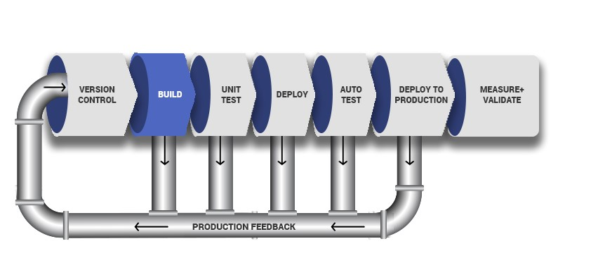

# EXPERIENCE CONTINUOUS INTEGRATION WITH JENKINS | ANSIBLE | ARTIFACTORY | SONARQUBE | PHP

**OBJECTIVE OF THIS PROJECT**

The objectives of this project include:

**Understanding the entire concept of CI/CD:** The project aims to provide a comprehensive understanding of Continuous Integration and Continuous Delivery (CI/CD) from an application perspective. It emphasizes the importance of grasping the entire CI/CD process, the roles of different tools involved, and the success metrics associated with it.

**Exploring different programming languages and platforms:** The project encourages gaining hands-on experience with CI/CD across various programming languages and platforms. While the focus is on PHP in this specific project, future projects will cover Java, Node.js, .Net, Python, as well as Terraform, Docker, and Kubernetes, providing a broader perspective of CI/CD from different application and platform viewpoints.

**Emphasizing the importance of Continuous Integration:** The project highlights the significance of Continuous Integration (CI) in software engineering. It explains the practice of merging developers' working copies to a shared mainline (e.g., a Git repository) multiple times per day. The objective is to reduce conflicts, run tests frequently, and avoid integration issues that can arise when multiple developers work on the same project.

**Encouraging test-driven development:** The project promotes the adoption of Test-Driven Development (TDD) alongside CI. Developers are encouraged to write unit tests for their code and run these tests locally before committing their work. This approach helps prevent one developer's code from breaking others' copies of the codebase.

**Leveraging a dedicated CI server:** The project introduces Jenkins as the chosen CI server. Instead of building the code into an executable locally, developers commit and push their work to a central repository, and the CI server takes over the build process. This setup allows for periodic builds or builds triggered after each commit, enabling visibility into each commit and its corresponding builds for the entire team.

**Running comprehensive tests in the CI environment:** While developers run tests locally, the project emphasizes the importance of running unit tests and other types of tests and code analysis on the CI server. These tests include Static Code Analysis, Code Coverage Analysis, Code Smells Analysis, Compliance Analysis, as well as Integration and Penetration tests. The CI server ensures the overall quality of the code, its compatibility with other developers' work, and its vulnerability to attacks.

**Deploying artifacts from the CI environment:** The project clarifies the difference between Continuous Integration (CI) and Continuous Delivery (CD). While CI focuses on the build and testing stages, CD ensures that the software checked into the mainline is always ready for deployment to users. The project introduces manual deployment triggered after successful QA tasks, and mentions Continuous Deployment as a further step, where the entire deployment process becomes fully automated.

# Architecture of the solution

